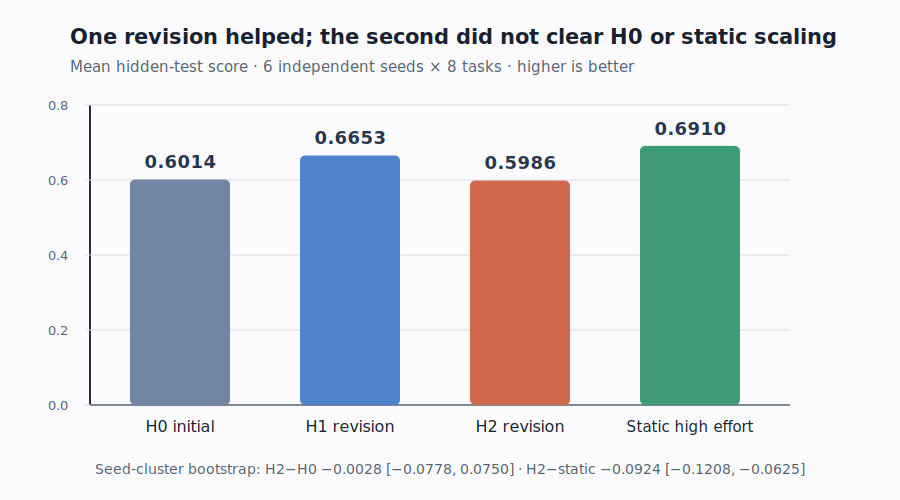

# Recursive Harness Self-Improvement: a bounded open-model reproduction

*Observed evidence from six independent-seed Kubernetes campaigns (48 paired task-seed observations). H1 improved the mean hidden-test score, but H2 returned to the H0 level and remained below a fixed high-effort harness. Brackets are seed-cluster bootstrap 95% intervals for the paired difference.*

Public Molab URL: <https://molab.marimo.io/github/alphaXiv/recursive-harness-self-improvement/blob/main/notebooks/rhi_reproduction.py>

## Central question and result

[Recursive Harness Self-Improvement](https://arxiv.org/abs/2607.15524) asks whether a coding agent can improve its own prompt-level multi-agent harness from local pairwise feedback. The paper reports that a few revisions lift low-effort Claude-family agents beyond stronger test-time scaling; for Sonnet, H2 wins 20 of 30 comparisons against the max-effort baseline. It attributes the gain to task-specific communication contracts and workflow hops rather than merely longer output.

This reproduction tested the same causal shape at smaller scale with one fixed open model. We found a **one-revision gain** but no reliable **two-revision gain**: H1 improved executable score by 0.0639 on average, while H2 was 0.0028 below H0. H2 also trailed the static high-effort control by 0.0924. The appropriate assessment is **partially aligned for early local improvement, divergent for persistence beyond static test-time scaling under this setup**.

All formal runs used Kubernetes on NVIDIA RTX PRO 6000 Blackwell GPUs. Each Job allocated four GPUs, peak concurrent allocation was 16 GPUs, and elapsed wall time from the first Kubernetes attempt to the final terminal run was 0.89 hours.

## What was reproduced

We created eight public, deterministic repository-building tasks across two domains:

- data infrastructure: ledger normalization, event compaction, dependency ordering, and recursive configuration merging;
- scientific computing: grid path finding, calibration metrics, molecular-formula parsing, and DNA motif matching.

Each task asks for a complete small repository with `solution.py`, `README.md`, and `pyproject.toml`. Unseen standard-library tests score the public API. The fixed open coding model was `Qwen/Qwen2.5-Coder-14B-Instruct`; four model replicas processed tasks concurrently within each Job.

For every task-run pair, the implementation generated:

1. a plain single-agent bootstrap artifact;
2. H0, the initial three-role harness;
3. H1, revised from H0-versus-plain feedback plus artifact evidence;
4. H2, revised from cumulative H0-versus-plain and H1-versus-H0 feedback;
5. a pre-authored static high-effort harness with five roles, 14 contract fields, and eight hops.

The same open model judged anonymous artifact pairs in both orders. A preference counted only when the forward and reversed judgments mapped to the same condition; disagreement became a tie. Executable tests were independent of those labels.

## Implementation path

The consequential code path is compact:

- `reproduce/tasks.py` defines the task contracts and hidden executable tests.
- `reproduce/harnesses.py` defines H0, the static control, optimizer-output validation, and role/contract/hop metrics.
- `reproduce/run_campaign.py` runs adviser, builder, reviewer, and repair calls; executes generated repositories in temporary directories; asks the reversed-order judge; and prints per-task plus final JSON evidence.
- `.orx/k8s.yaml` requests four GPUs and runs the inherited command `bash run.sh`.

The harness is a structured prompt object, not executable graph code. Adviser calls produce contracted memos, the builder produces repository JSON, reviewers return blockers, and one targeted repair call emits the final repository. This reconstructs the paper's roles/contracts/hops mechanism without provider-specific subagent APIs.

Two infrastructure-only corrections preceded valid evidence: evaluating the injected Kubernetes clone script and installing the pinned `accelerate` runtime. They did not change tasks, prompts, model, evaluator, or scoring. The frozen root failure and cancelled dependency scout are excluded from results.

## Primary evidence

| Condition | Mean executable | Mean fixed rubric | Output tokens/task | Input tokens/task | Peak context/task |
|---|---:|---:|---:|---:|---:|
| H0 initial | 0.6014 | 0.6612 | 2,077.9 | 3,483.3 | 1,966.8 |
| H1 revision | 0.6653 | 0.7155 | 2,197.6 | 3,580.6 | 2,027.0 |
| H2 revision | 0.5986 | 0.6588 | 2,167.0 | 3,552.5 | 1,999.0 |
| Static high effort | 0.6910 | 0.7373 | 3,551.6 | 6,384.9 | 3,154.1 |

The fixed rubric is 85% executable-test score and 15% required-file coverage. Coverage was intentionally low-weight because executable behavior is the stronger evidence channel.

| Paired comparison | Mean difference | 95% bootstrap interval | Better / equal / worse |
|---|---:|---:|---:|
| H1 − H0 | +0.0639 | [+0.0222, +0.1049] | 18 / 17 / 13 |
| H2 − H0 | −0.0028 | [−0.0778, +0.0750] | 13 / 21 / 14 |
| H2 − static | −0.0924 | [−0.1208, −0.0625] | 9 / 17 / 22 |

Intervals are descriptive nonparametric bootstraps over the six seed-level paired means, preserving all eight task identities within each resampled seed. Six clusters are still too few for a population-level benchmark guarantee.

The open judge was highly order-sensitive. Reversed-order consensus gave H2 7 wins versus 4 for H0, with 37 ties; against static, H2 had 1 win versus 10, with 37 ties. Only 12/48 H2-versus-H0 and 11/48 H2-versus-static comparisons were order-consistent. This supports the requested safeguard and shows why the executable metric leads the assessment.

## Mechanism and scaling controls

Output length does not explain an H2 gain because there was no aggregate H2 gain. H2 used only 4.3% more output tokens than H0 and nearly the same peak context, while static used 70.9% more output tokens and scored higher. Provider-style cache read/write counters are not exposed by Transformers, so the runs record that field as unavailable and log input tokens, peak context, and repeated-prefix opportunity instead. No provider-cost or KV-cache reduction claim is made.

Natural optimizer revisions changed little structurally on average:

| Harness | Roles | Contract fields | Hops | Gates | Task lexical overlap |
|---|---:|---:|---:|---:|---:|
| H0 | 3.00 | 7.00 | 4.00 | 2.00 | 0.1253 |
| H1 | 3.00 | 7.00 | 4.00 | 2.50 | 0.1315 |
| H2 | 3.00 | 7.00 | 4.00 | 2.71 | 0.1342 |
| Static | 5.00 | 14.00 | 8.00 | 3.00 | 0.1546 |

An exploratory mechanism branch forced every update to add evidence-grounded contract fields and explicit recall/retest hops. H2 then reached 10.13 contract fields and 8.5 hops, but executable score fell from 0.7333 at H0 to 0.5375 at H2; peak context rose from 1,936 to 2,706 tokens. More structural machinery was therefore not sufficient.

The artifact-only optimizer ablation removed cumulative pairwise history but retained repository excerpts and executable evidence. Its H2 improved from 0.5375 to 0.6083 yet still trailed static at 0.7000. Because generation is sampled and this is one run, it is exploratory, but it does not suggest that pairwise history was necessary for the observed local improvements.

## Claim-by-claim assessment

| Target claim | Paper evidence | Observed evidence | Assessment under this setup | Compute evidence |
|---|---|---|---|---|
| Two local RHI revisions improve task score and preference over H0 | Few revisions raise pairwise wins; Sonnet H2 wins 20/30 against max effort | H2 executable 0.5986 vs H0 0.6014; H2/H0 preference 7/4 with 37 ties | Inconclusive on preference and not aligned on executable mean; H1 shows a transient gain | Six primary Kubernetes Jobs, 15m28s–17m00s each |
| Gain persists against static high effort | RHI exceeds xhigh/max/ultracode settings | H2 0.5986 vs static 0.6910; preference 1/10 with 37 ties | Divergent under this open-model, eight-task setup | Same six paired Jobs; static ran inside each Job |
| Gain reflects task-specific contracts/hops, not length | Paper reports task clustering and flat output-token use | Natural contracts/hops barely changed; forced growth regressed; H2 output remained close to H0 | Output-length alternative is not supported, but the claimed structural mechanism was not observed | Six primary Jobs plus one 21m05s structural-ablation Job |
| Cache/cost efficiency improves | Up to 60% lower provider-normalized cost | Provider cache counters unavailable; only context and prefix proxies exposed | Not attempted faithfully | No additional Job; telemetry absent from all completed runs |

## Evidence boundary and limitations

This is a clean-room reconstruction because no implementation or exact initial prompts were released. The open model is substantially smaller than the paper's Claude models, the task suite is deterministic and code-centric rather than open-ended ML research, and the evaluator is the same open model family rather than two stronger judges. The bootstrap unit repeats task identities across seeds. The first update is bootstrapped from H0 versus a plain predecessor, then the second uses cumulative trajectory-local history; this is a bounded operationalization, not a claim of exact algorithmic identity.

The strongest conclusion is narrow: **with this model, harness engine, task suite, and wall limits, a first local revision often helped, but a second did not reliably accumulate the gain, and neither the primary runs nor structural enforcement surpassed the static high-effort control.** A full-scale reproduction would need the authors' exact initial harnesses and optimizer prompts, independent stronger judges, their 30 tasks, and provider-native cache/cost telemetry.

## Reproduction provenance

Important branches are linked from the repository [README](../../README.md). The successful primary campaigns each used the exact command `bash run.sh` on four Kubernetes GPUs and lasted 15m28s–17m00s; the enforced-structure mechanism Job lasted 21m05s. Peak concurrent allocation was 16 NVIDIA RTX PRO 6000 Blackwell GPUs. The full campaign's actual elapsed wall time was 0.89 hours.

The [self-contained marimo notebook](../../notebooks/rhi_reproduction.py) opens with these measured values and offers bounded interactive comparisons without rerunning model inference.
